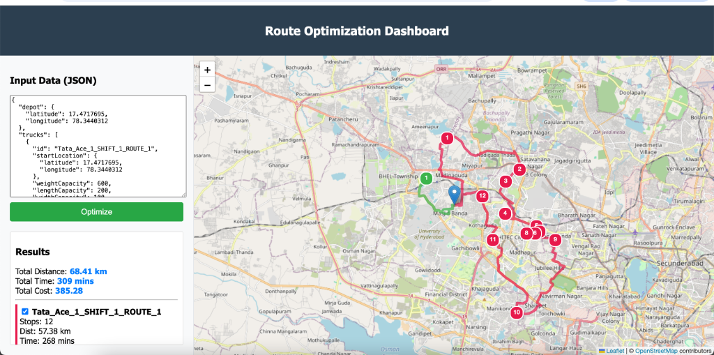
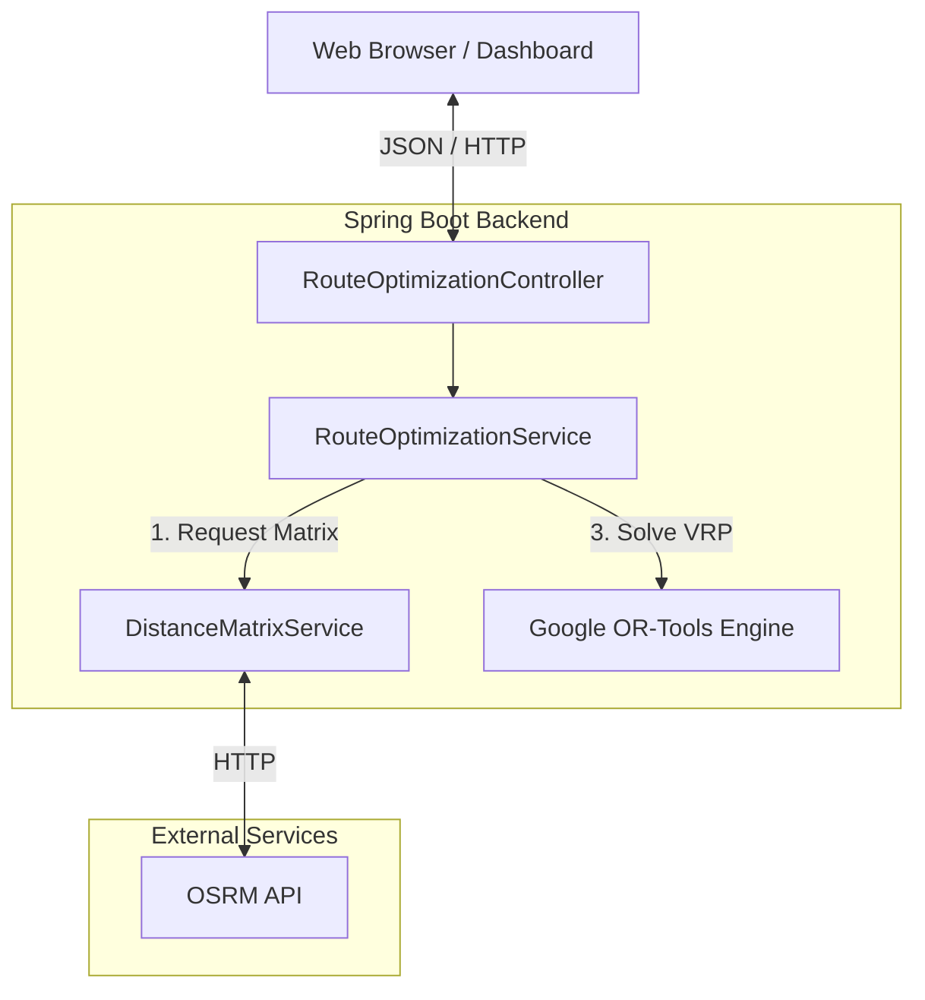

# Route Optimization & Visualization POC



## 1. Business Use Case
This project implements a **Vehicle Routing Problem (VRP)** solver designed for logistics and last-mile delivery optimization. It addresses the challenge of efficiently assigning delivery orders to a fleet of vehicles while adhering to real-world constraints.

**Key capabilities:**
*   **Capacity Constraints**: Respects vehicle limits on Weight, Volume (Length, Width, Height), and Max Stops.
*   **Cost Minimization**: Optimizes routes to minimize total operational costs, factoring in:
    *   Distance-based costs (Fuel/Wear).
    *   Time-based costs (Driver wages).
    *   Fixed costs per vehicle usage.
*   **Unassigned Order Handling**: Gracefully handles impossible orders by "dropping" them with a penalty, ensuring the solver always returns the best possible partial solution rather than failing.
*   **Interactive Visualization**: Provides a map-based dashboard for planners to visualize routes, toggle visibility, and analyze metrics (Cost, Distance, Time).

## 2. Technology Stack

### Backend
*   **Java 17**: Core language.
*   **Spring Boot 3.x**: Application framework for REST APIs and dependency injection.
*   **Google OR-Tools**: High-performance constraint solving engine used for the VRP logic.
*   **Mapbox / GraphHopper / OSRM**: (Configurable) Used for:
    *   **Distance Matrix**: Calculating real-world travel distances and times between all points.
    *   **Route Geometry**: Fetching the actual road path (polyline) for map visualization.
    *   *Current Configuration*: **OSRM (Open Source Routing Machine)**.

### Frontend
*   **HTML5 / CSS3**: Responsive dashboard layout.
*   **JavaScript (ES6)**: Client-side logic for API changes and state management.
*   **Leaflet.js**: Open-source JavaScript library for interactive maps.

## 3. Architecture

The system follows a standard Layered Architecture:



### Data Flow
1.  **Input**: User sends a JSON request with `Depot`, `Trucks` (capabilities/costs), and `Orders` (locations/demands).
2.  **Distance Calculation**: The system calls OSRM to build a `N x N` Distance and Time matrix for all locations.
3.  **Optimization**: `RouteOptimizationService` configures the Google OR-Tools model with:
    *   Dimensions: Weight, Volume, Stops, Time.
    *   Objective: Minimize `(Distance * CostPerKm) + (Time * CostPerMin) + FixedCosts`.
4.  **Solving**: OR-Tools iterates to find the optimal assignment and sequence.
5.  **Geometry Fetching**: (Frontend) The browser constructs the map and requests detailed path geometry from OSRM for the resulting stop sequences.
6.  **Visualization**: Results are rendered on the Leaflet map with interactive controls.

## 4. How to Run

### Prerequisites
*   Java 17+
*   Maven

### Steps
1.  **Start the Server**:
    ```bash
    ./mvnw spring-boot:run
    ```
    The application will start on `http://localhost:8080`.

2.  **Access the Dashboard**:
    Open your browser to `http://localhost:8080`.

3.  **Optimize**:
    *   Paste your JSON input into the text area.
    *   Click "Optimize Routes".

### Configuration
*   **OSRM**: By default, it may point to a public OSRM server or localhost. Configure `osrm.baseUrl` in `application.properties`.

## 5. Docker Deployment

### Build and Run with Docker Compose
1.  **Build and Start**:
    ```bash
    docker-compose up --build -d
    ```
    The application will be accessible at `http://localhost:8080`.

2.  **Stop**:
    ```bash
    docker-compose down
    ```

### Manual Docker Build
1.  **Build Image**:
    ```bash
    docker build -t route-optimizer .
    ```

2.  **Run Container**:
    ```bash
    docker run -p 8080:8080 -e OSRM_BASE_URL=http://router.project-osrm.org route-optimizer
    ```
